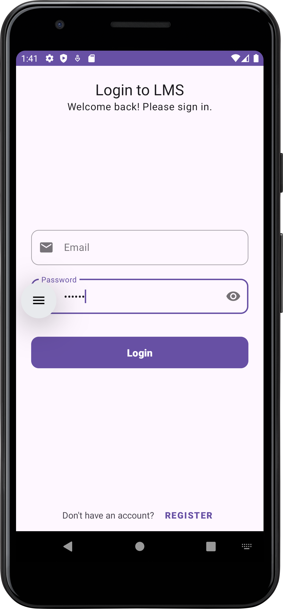

# Library Management System (LMS) - React, Android, & Node.js

This is a full-stack Library Management System project featuring a multi-frontend architecture served by a single robust backend. The system provides three distinct interfaces tailored to the roles of **Admin**, **Librarian**, and **User**.

-   **Admin & Librarian Portals**: A comprehensive web application built with **React.js**.
-   **User Client**: A native mobile application built with **Java for Android**.
-   **Backend API**: A central RESTful API powered by **Node.js and Express.js** that serves all three frontends.

## Features

This project is divided by user roles, with features designed to meet the needs of each group.

### User Features (Android App)

-   **👤 Secure Authentication**: Register and log in with a JWT-based system.
-   **📊 Personalized Dashboard**: Get an at-a-glance view of borrowed books and due dates.
-   **🔎 Advanced Book Search**: Search the library catalog by title, author, ISBN, or subject.
-   **📖 Book Details & Availability**: View detailed book information and real-time copy availability.
-   **📚 Borrowing History**: Track currently borrowed books and past borrowing history.
-   **🔧 Profile Management**: Update personal information and change passwords securely.

### Admin & Librarian Features (React.js Web App)

-   **👑 Role-Based Access Control**: Separate dashboards and permissions for Admins and Librarians.
-   **📚 Book & Inventory Management**: (Admin) Add, update, and remove books and individual copies from the library catalog.
-   **👥 Member Management**: (Admin) Onboard new members, manage user profiles, and view borrowing history.
-   **📈 Analytics Dashboard**: (Admin) View key library metrics like most borrowed books, user activity, and fine collections.
-   **🔄 Issue & Return Processing**: (Librarian) Manage the checkout and check-in process for books.
-   **💰 Fine Management**: (Librarian) Calculate and manage overdue fines for members.

## Architecture

The system is designed with a decoupled frontend-backend architecture, where multiple clients communicate with a central API.

## Tech Stack

### Web Frontends (Admin & Librarian)

-   **Framework**: [React.js](https://reactjs.org/)
-   **Styling**: CSS, Material-UI (or your choice)
-   **API Client**: [Axios](https://axios-http.com/)
-   **State Management**: Context API / Redux (optional)

### Mobile Frontend (User)

-   **Language**: [Java](https://www.java.com/en/)
-   **UI**: XML, Material Design Components
-   **API Client**: [Retrofit 2](https://square.github.io/retrofit/)

### Backend (REST API)

-   **Framework**: [Node.js](https://nodejs.org/en) with [Express.js](https://expressjs.com/)
-   **Database**: [MySQL](https://www.mysql.com/)
-   **Authentication**: [JSON Web Tokens (jsonwebtoken)](https://www.npmjs.com/package/jsonwebtoken)

## Screenshots

### Web Portals (Admin/Librarian)

| Admin Dashboard                             | Book Management                             |
| ------------------------------------------- | ------------------------------------------- |
|  |  |

### Android App (User)

| Login Screen                                | Dashboard                                   |
| ------------------------------------------- | ------------------------------------------- |
|  |  |

## Getting Started

Follow these steps to get the entire project running locally.

### Prerequisites

-   [Node.js](https://nodejs.org/en/download/) & npm
-   [Android Studio](https://developer.android.com/studio)
-   A running [MySQL](https://www.mysql.com/downloads/) server

### 1. Backend Setup
#### 1. Clone the repository and navigate to the backend directory 
    git clone [https://github.com/TheSBVaidya/MERN-Library_Management_System.git] cd your-repo-name/backend

#### 2. Install dependencies
    npm install

#### 3. Create a .env file and add your database and JWT configuration
    DB_HOST=localhost
    DB_USER=your_mysql_user
    DB_PASSWORD=your_mysql_password
    DB_NAME=your_database_name
    JWT_SECRET=your_super_secret_key

#### 4. Initialize the database with the provided .sql schema file

#### 5. Start the server
    npm start

### 2. Web Frontend Setup (React)
#### 1. Navigate to the React app directory from the root folder
    cd ../react-admin-librarian  #<-- Change this to your folder name

#### 2. Install dependencies
    npm install

#### 3. Start the React development server
    npm start

### 3. Mobile Frontend Setup (Android)
#### 1. Open the android-user directory (or your folder name) in Android Studio.
#### 2. Allow Gradle to sync dependencies.
#### 3. Important: In your RetrofitClient.java file, update the BASE_URL to your computer's local network IP address (e.g., http://192.168.1.10:3000/api/). localhost will not work from the emulator.
#### 4. Build and run the app on an Android Emulator or a physical device.

#
**License
Distributed under the MIT License.** See LICENSE for more information.

Contact
- **Sanjay Vaidya** - [LinkedIn](https://www.linkedin.com/in/sanjay-vaidya-058758272/)

- **Project Link:** [Project-Link](https://github.com/TheSBVaidya/MERN-Library_Management_System)
